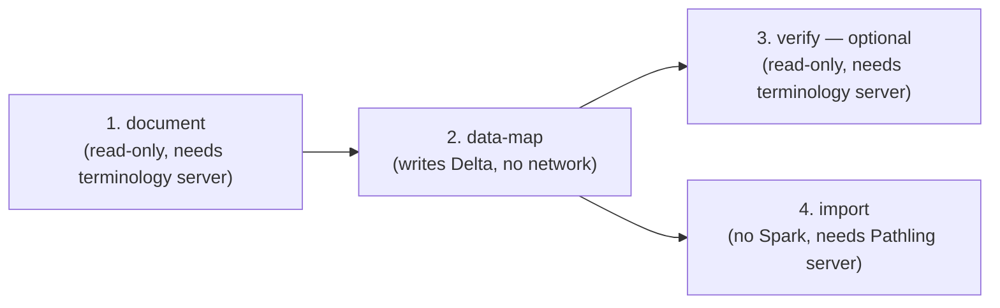

# Merged-profile provisioning

Applies a merged-profile terminology facade to MIMIC resources whose
sub-type StructureDefinitions were collapsed into a single Delta table
during preprocessing (e.g. Observation's labevents/chartevents/vital-signs
sub-types all land in one `Observation.parquet` table). See the module
docstring in `provision.py` for the full background.

All commands below are `uv run python provision.py ...` from this directory
(or `uv run python scripts/merged_profile_provisioning/provision.py ...`
from the repo root).

## The four modes, in order



### 1. `document` — discover what needs merging, draft the FSH

Read-only. For each resource (or every `<Resource>.parquet` table under a
warehouse root, if `--resource` is omitted), finds the distinct sub-type
`meta.profile` values in the data, resolves each one's coded-element
binding ValueSet on the terminology server, and writes a summary JSON +
suggested FSH draft under `--out-dir` (one subfolder per resource).

```bash
uv run python provision.py \
  --mode document \
  --data /path/to/spark-warehouse \
  --out-dir artifacts
```

**A human then hand-authors the real FSH** (`SD_Mimic<Resource>Merged.fsh` /
`VS_Mimic<Resource>Merged.fsh` under `input/fsh/`) from the suggested
drafts, and that FSH gets published as part of the IG's normal build. This
script never writes to the terminology server.

Needs network access (reads from the terminology server) — run this on a
machine/node that has it.

### 2. `data-map` — remap the data in place

Overwrites `meta.profile` on the Delta table so every row that carried one
of the discovered sub-type profiles now carries the single merged
StructureDefinition URL. In-place `UPDATE`, no full-table rewrite.
`--resource` optional — omit it (with `--data` pointing at the warehouse
root) to sweep every table in one run.

```bash
uv run python provision.py \
  --mode data-map \
  --data /path/to/spark-warehouse \
  --dry-run   # drop this once the matched-row counts look right
```

**Never talks to a network** — pure Delta read/write. This is the one mode
that runs on an isolated HPC compute node with no internet access; see
`provision_data_map.slurm` for the Petrichor job that runs it against the
full MIMIC dataset on a shared scratch drive.

### 3. `verify` — optional sanity check

Read-only. Prints a sample of `meta.profile` from the data and, for each
distinct profile present, resolves it on the terminology server and prints
its coded-element binding ValueSet. Run after `data-map` to confirm the
rows now point at the merged StructureDefinition.

```bash
uv run python provision.py \
  --mode verify \
  --resource Observation \
  --data /path/to/spark-warehouse/Observation.parquet
```

Needs network access (terminology server) — same constraint as `document`.
On Petrichor, run this on the login node, not the compute node.

### 4. `import` — push the remapped data into Pathling

Never touches Spark/Delta at all. Discovers which resources need
importing by scanning the subfolders of `--out-dir` (the `artifacts/` tree
`document` wrote — one subfolder per resource that actually needed
merging), builds a single FHIR `$import` request (Parquet input,
`saveMode=overwrite`, one input entry per resource at
`<--import-base-url>/<Resource>.parquet`), and POSTs it to Pathling with
async polling until the job completes.

```bash
uv run python provision.py \
  --mode import \
  --out-dir artifacts \
  --import-base-url file:///scratch3/nau025/mimic-on-fhir-delta/spark_warehouse \
  --token "$PATHLING_ACCESS_TOKEN" \
  --dry-run   # drop this once the request body looks right
```

Run this from a **network-connected** machine, separately from the
`data-map` run — on Petrichor the compute node that ran `data-map` has no
internet access, so this step happens afterwards from somewhere that can
reach `--pathling-url` (default `https://pathling.dw.csiro.au/fhir/`).
`--import-base-url` is the warehouse root as *Pathling's server* sees it
(e.g. an S3 path), which may differ from the local `--data` path used in
step 2 if the HPC job and the Pathling server don't share identical mount
points.

If `data-map` ran without a matching `document` run first (e.g. it swept a
whole warehouse directly, so there's no `artifacts/` tree to read), pass
`--resources` explicitly instead of relying on `--out-dir` discovery. This
also matters the *first* time a full-MIMIC dataset is pushed to Pathling:
include every resource type present in the warehouse, not just the ones
`data-map`'s summary reported as "remapped" — a resource can show `empty`
locally (nothing needed remapping, e.g. Observation, which was already
merged) while the Pathling server has still never received *any* copy of
it, merged or not.

```bash
uv run python provision.py \
  --mode import \
  --import-base-url file:///scratch3/nau025/mimic-on-fhir-delta/spark_warehouse \
  --resources Condition Encounter Location Medication MedicationAdministration \
              MedicationDispense MedicationRequest MedicationStatement Observation \
              Organization Patient Procedure Specimen \
  --token "$PATHLING_ACCESS_TOKEN" \
  --dry-run
```

`saveMode` is hardcoded to `overwrite` rather than exposed as a flag —
`merge` (upsert by ID) buys nothing here: the full source file still has
to be read and transferred either way, so there's no bandwidth or time
saved, and on a first sync there's nothing on the server to merge against
anyway.

## Two use cases

- **Local demo data**: run `document` → `data-map` → `verify` against a
  small local Delta warehouse, all on your own machine.
- **Full MIMIC data on HPC**: run `document`/`verify` (network needed) from
  the login node, run `data-map` (no network) on the compute node via
  `sbatch provision_data_map.slurm`, then run `import` from a
  network-connected machine afterwards to push the remapped data into the
  shared Pathling server.
